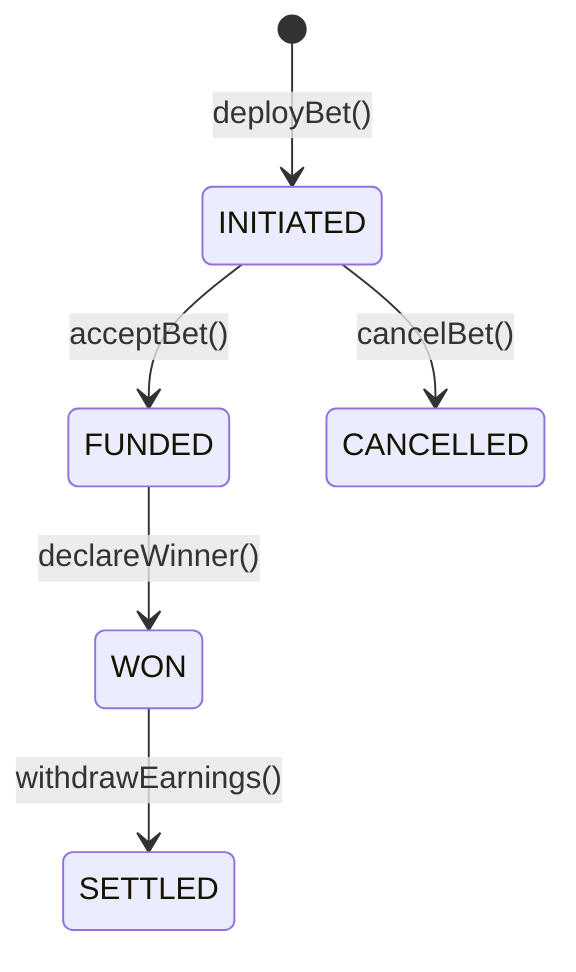

# ShakeOnIt Protocol

ShakeOnIt is a decentralized application (dApp) that facilitates the creation and management of bets between users. Create a friendly bet between friends, or accept any bets that are still open on the platform.

## Project Structure

The project is divided into several smart contracts, each responsible for a specific aspect of the system. Below is a detailed explanation of each contract and its purpose.

### Contracts

#### DataCenter.sol

The `DataCenter` contract acts as the central information hub for the ShakeOnIt system. Use it to get the current User and Bet Management contracts.

**Key Functions:**

- `getMultiSig()`: Returns the multi-signature wallet address. (lol stop watching my pockets, yo)
- `getUserStorage`: Returns the address of a user's `UserStorage` contract.
- `getUserManagement()`: Returns the address of the `UserManagement` contract.
- `getBetManagement()`: Returns the address of the `BetManagement` contract.

#### UserManagement.sol

The `UserManagement` contract handles the registration and management of users within the ShakeOnIt system. It ensures that each user has a corresponding `UserStorage` contract to store their bets.

**Key Functions:**

- `register(string username, address betManagement)`: Registers a new user and creates a `UserStorage` contract for them.
- `getUserStorage(address _user)`: Returns the address of the user's `UserStorage` contract.
- `getUsers()`: Returns a list of all registered users.

#### BetManagement.sol

The `BetManagement` contract handles the creation and management of bets. It stores the details of each bet and ensures that all bets are properly tracked and managed.

**Key Functions:**

- `deployBet(address _token, UserDetails memory _initiator, UserDetails memory _arbiter, uint256 _stake,uint256 _arbiterFee, uint256 _platformFee, uint256 _payout, string memory _condition)`: Creates a new `Bet` and stores it in the user's `UserStorage` contract.

#### UserStorage.sol

The `UserStorage` contract is deployed for each user and stores the details of all bets they are involved in. It ensures that users can easily track their betting history.

**Key Functions:**

- `addBet(address _bet)`: Adds a new bet to the user's storage.
- `getBets()`: Returns a list of all bets stored in the contract.
- `grantApproval(address _token, address _spender, uint256 _amount)`: Grants the `_spender` the ability to spend `_amount` from your `UserStorage` contract. You will need to call this to grant the `BetManagement` in order to create a bet.

#### Bet.sol

The `Bet.sol` contract is created by calling the deployBet() function in the bet management contract. This contract is in charge of all bet functionality.

**Key Functions**

- `acceptBet()`

### State Transitions



### Deployments
#### BASE-SEPOLIA TESTNET:

- User Management Contract: ```0x7f68AAE9C9cB52E4689763F9Ef2c859778578230```
- Bet Management contract: ```0x021b140B5F931237eD6934B539dE57c111584754```
- Data Center contract: ```0x934726B886D24fdD98701aF57BedcBCd137870FF```
- Vbux contract: ```0x9D2A5b0B86a630333eBC02E3cd080Dc60Fe583F9```